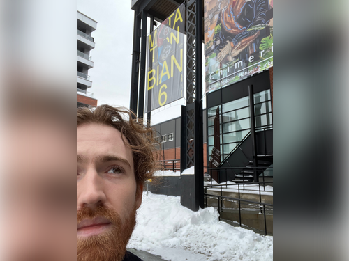
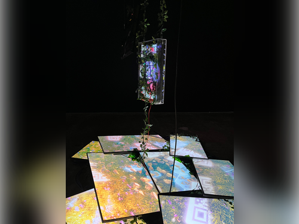
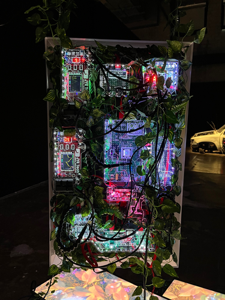

# BIAN

La Biennale internationale d'Art numérique (BIAN) est un événement majeur dans le monde de l'art numérique. Cette exposition, créée en 2012, se déroule à Montréal, au Canada, et présente plusieurs projets d'art numérique et de nouveaux médias, notamment des installations interactives, des performances, des projections et des visites guidées. Cet événement est une exposition temporaire qui se déroule tous les deux ans à Montréal. 

Les installations et les œuvres d'art présentées sont principalement exposées à l'intérieur en raison des équipements électroniques qu'on y retrouve. La BIAN a pour but de rassembler des artistes, des designers ainsi que des technologues pour explorer les différents défis et les opportunités de l'ère numérique et pour célébrer l'art numérique sous toutes ses formes. La Biennale vise également à promouvoir la création artistique et la recherche sur les technologies numériques. La BIAN est un événement incontournable pour tous les amateurs d'art numérique qui cherchent à découvrir les tendances les plus récentes et les plus novatrices de ce domaine en constante évolution.

Lors d'une visite de groupe, j'ai eu la chance de pouvoir assister à cette exposition le 2 février dernier située au 5445 av. de Gaspé, Montréal, QC H2T 3B2.

## Nature Morte 7

Johann Baron Lanteigne, artiste montréalais, a créé Nature Morte 7 en 2022. Selon le cartel mis à disposition, l'œuvre est décrite comme suit :

«Nature Morte 7 présente une fenêtre – unique mais fragmentée – composée d'écrans posés au sol. Elle ouvre sur un monde oublié, mais toujours en activité. La pièce centrale de cette œuvre combine un écran avec diverses composantes électroniques qui s'illuminent. La sculpture suspendue tourne le dos au spectateur, afin de mettre en évidence son fonctionnement interne. Les « électroniques grand public » dont l'œuvre est composée sont délibérément sorties de leur contexte habituel. Cela permet de révéler leur potentiel, qui est souvent banalisé.

L'œuvre fait appel au contenant autant qu'au contenu ; l'électronique physique est aussi apparente que ce qui est affiché à l'écran. Toutes les deux invitent à la réflexion en liant nos deux réalités vécues, physique et virtuelle. Le réseau modulaire d'électronique que l'on voit à l'arrière de la sculpture crée une lueur qui étend le monde virtuel dans l'écran, à l'aide de la lumière. L'œuvre agrandit et exagère également l'espace que prend une telle technologie, afin de souligner son omniprésence.»

L'installation contemplative imaginée par cet artiste implique des vidéos en boucle sur les écrans. Cliquez ici [https://vimeo.com/669257884] pour un aperçu.

L'oeuvre se situait en plein milieu de l'espace réservé. Les télévisions au sol représentaient l'étendue de l'oeuvre que j'évaluerais dans les alentours de 8 pieds par 8 pieds. Au-dessus de ces télévisions, on y retrouve deux télévisions suspendues. Chacune d'entre elles est suspendue par deux fils d'acier sur des crochets ainsi qu'attachée à une barre de métal proche du plafond de l'immeuble, évalué à trois ou quatre étages.

## Composantes et techniques

Les composantes de l'oeuvre se composent de 10 écrans dont une qui fait partie de la boîte principale avec les diverses composantes électroniques. Une multitude de fils se situe sous les télévisions du sol ce qui rendait la vue difficile pour certaines composantes qui pourraient s'y retrouver. L'artiste a aussi ajouté des vignes sortant de la boîte pour suivre l'idée et la réflexion autour de la Nature Morte 7.

Étant donné que l'oeuvre comprend plusieurs écrans, beaucoup de fils sont nécessaires pour faire fonctionner le tout. Malgré qu'elle se situe en plein milieu de l'espace, la majorité des fils ont pu être cachés sous les télévisions situées au sol à l'exception de quelques composantes électroniques que nous pouvons apercevoir lorsque nous nous rapprochons. De plus, comme cité ci-dessus, il était nécessaire de suspendre les télévisions par deux fils de fer au plafond pour être certains qu'elles ne tombent pas.

## Expérience vécue

À première vue, l'oeuvre est simpliste et très abstraite. Cependant, après mon analyse personnelle et en écoutant les guides de la visite, j'ai rapidement compris l'image que l'artiste a voulu projeter avec celle-ci concernant l'ère virtuelle qui envahit notre quotidien ainsi que les problèmes environnementaux qui en découlent. L'oeuvre est contemplative donc nous pouvons interagir avec elle mais tous les écrans sont liés visuellement sur ce qu'ils projettent : le monde virtuel composé de la main dans la boîte principale ainsi que de la verdure. J'ai trouvé intéressant l'ajout des codes QR dispersés sur les animations qui nous rappellent la technologie qui nous entoure.

## Ce qui m'a plu, donné des idées

J'ai trouvé la signification assez choquante et impressionnante en même temps, ce que j'ai vraiment aimé. De plus, cela m'a permis de comprendre aussi qu'une oeuvre multimédia n'est pas nécessairement de grande ampleur et qu'il suffit de quelques télévisions et de connaissances électroniques pour pouvoir concevoir une oeuvre impressionnante et choquante. Le concept est très original et les animations 3D comme celle-ci sont des pièces d'art qui m'attirent beaucoup. Cela me motive à peut-être éventuellement me spécialiser dans ce type d'art.

## Ce qui m'a moins plu

Ce qui m'a moins plu dans l'œuvre de Johann est l'utilisation obligatoire d'un support provenant du plafond, ce qui la rend moins facilement transportable et adaptable à différents espaces. Personnellement, si je réalisais une œuvre aussi sophistiquée, je souhaiterais qu'elle puisse être présentée dans n'importe quel endroit, sans nécessiter de fixation au plafond. De plus, la visibilité de certaines composantes électroniques sous les écrans m'a également dérangé. Je pense que si les fils avaient été mieux dissimulés, cela aurait ajouté un effet supplémentaire à l'œuvre et amélioré son apparence générale.

## Références
- https://arsenalcontemporarysale.ticketpro.ca/fr/pages/arsenal_art_contemporain_bian2022
- https://www.artsouterrain.com/artiste/johann-baron-lanteigne/

