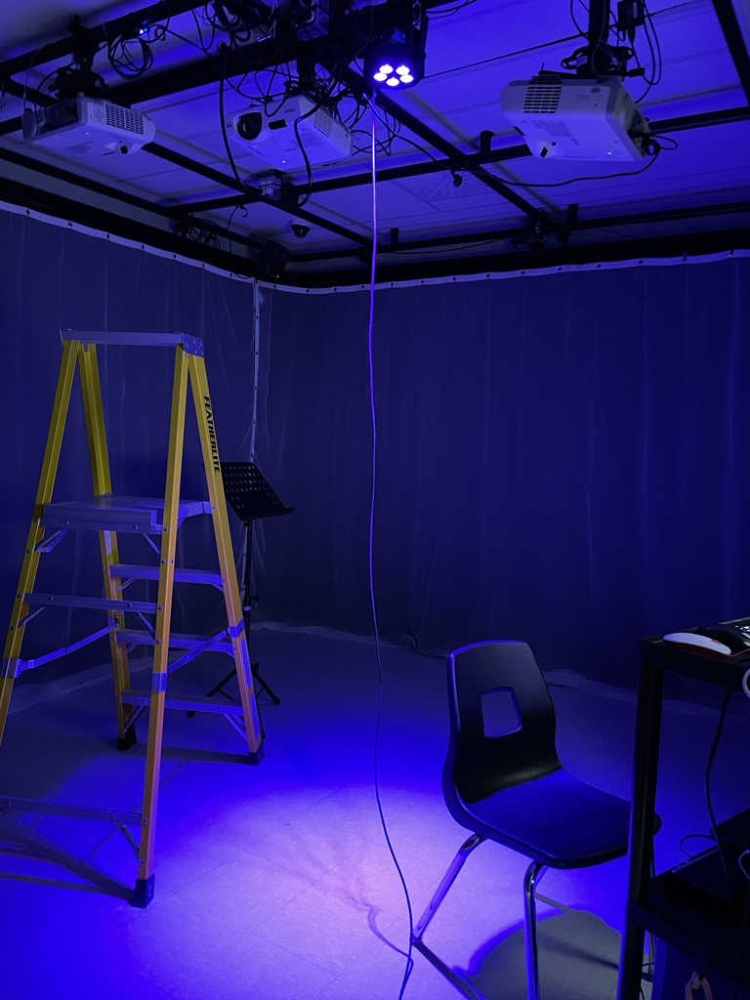

# Exploration des projets en création par les étudiant.e.s de 3e année en TIM

## 1. Entre Fungus(Edria)
### Description du projet
Ce projet est une installation interactive. Le but de cette installation est de mettre en contraste l'espace dans laquelle l'oeuvre se trouve, soit un espace conçu pour se retrouver entre amis, diner ou même étudier avant un examen, et les conditions météorologiques dans lesquelles l'oeuvre sera déployée, Soit les derniers mois de l'hiver, peu enclin à utiliser l'espace comme il a été pensé. Ce contraste est une métaphore qui relie notre projet au thème fédérateur, soit le biopunk. Dans cette métaphore, l'espace dans lequel notre projet sera déployé représente la nature, qui est elle-même l'espace dans lequel l'être humain a déployé son projet de société, et le climat est l'industrialisation, qui, froide et sans pitié, nous laisse avec un espace encombré de machine et dépourvue de vie. Notre oeuvre fait une deuxième allusion à l'industrialisation en incorporant des structures métalliques et artificiel dans l'espace. Ces structures sont recouvertes de fausses plantes, qui viennent également contraster avec le climat dans lequel l'oeuvre sera déployée, pour représenter le désir de l'humanité de cacher sa destruction de la nature. Finalement, l'oeuvre est parsemée de champignons lumineux représentant la fin de la boucle de l'industrialisation, puisque les champignons sont la dernière étape du cycle de la vie. Entre-Fungus a été réalisé par:
- Elwin Durand
- Loic Delorme
- Dominic Roberts
- Gabriel Leblanc
- Meryem Berbiche
- Jean-Christophe

## 2. Boucler la boucle(Nexum)
### Description du projet
Ce projet comprend une expérience lumineuse immergeante, des animations sensationnels et une ambiance musicale des plus spécials. Ce parcours interactif permet la communion entre l'humain et la nature tout en nous plongeant au coeur d'un marais aux apparences magique. Boucler la boucle a été réalisé par:
- Sébastien Reilly
- Sabrina Laforest
- Alexandre Daniel
- Maxime Des Lauriers

## 3. Luma Sol
### Description du projet
Le projet démontre l'importance pour les humains de demeurer en contact avec la nature en raison de l'urgence climatique que nous vivons actuellement. C'est par l'action, en pédalant dans ce cas, qu'on peut avoir un impact positif sur l'environnement lumineux. LumaSol a été réalisé par:
- Éloïse Gagné
- Skayla Stimphil
- Michaël Simard
- Pénélope Morrisson

## 4. Echomarine
### Description du projet
Le projet est une projection sur 3 murs qui nous donne un aperçu de la beauté des fonds marins et de sa population en menace d’extinction. Animaux interactifs et plantes marines. Echomarine a un but contemplatif et vise à conscientiser. Echomarine a été réalisé par:
- Florence Lapierre
- Natacha Abdallah
- Tracy Gua
- Maria Laura Coronel

## Compétences nécessaires
Les projets comportent un grand nombre de compétences nécessaires à leur réalisation. Quelques-une d'entres-elles sont:
- Le cours d'animation 2D est nécéssaire pour les différentes animations utilisés dans les visuels comme Echomarine
- Les différents cours d'audio sont éssentiels pour créer l'ambiance et les différents bruitages.
- Le cours de traitement audiovisuel est important aussi pour pouvoir bien intégrer les différentes composantes du projet. 
## Nouvelle connaissance
Lorsque j'ai assisté au montage des différents projets, j'ai découvert une composante technologique que je ne connaissais pas auparavant : le Raspberry Pi. Ce petit ordinateur monocarte est utilisé pour créer des installations interactives, des installations sonores, des projets de réalité virtuelle et bien plus encore. Dans l'un des projets, le Raspberry Pi a été utilisé pour contrôler les effets lumineux et sonores. Grâce à sa petite taille, sa faible consommation d'énergie et ses capacités de traitement, le Raspberry Pi était parfait pour ce projet. C'est un outil polyvalent offrant une grande flexibilité et une grande créativité dans la conception de nouvelles expériences artistiques.
## Expérience personelle
En expérimentant chacune des installations, je pense que je ressentirai un mélange d'excitation et de surprise. En tant que spectateur, j'aurai la chance de découvrir les créations artistiques des quatres équipes et de voir comment elles ont été conçues et réalisées. Je serai probablement émerveillé par les effets visuels et sonores, ainsi que par les interactions créatives que les projets permettent.  Les projets artistiques multimédia nécessitent souvent une grande quantité de travail et de créativité, et je suis convaincu que les équipes ont réussi à créer des œuvres d'art vraiment uniques et inspirantes.

## Références
- https://tim-montmorency.com/2023/projets/EDRIA/docs/web/index.html
- https://tim-montmorency.com/2023/projets/Nexum/docs/web/index.html
- https://tim-montmorency.com/2023/projets/LumaSol/docs/web/index.html
- https://tim-montmorency.com/2023/projets/Echomarine/docs/web/index.html

