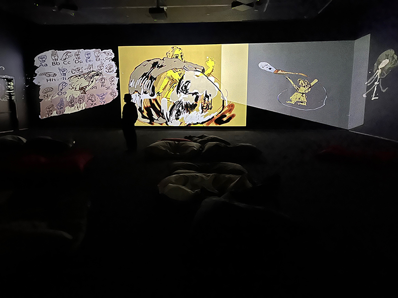

# Par-delà les frontières

Le 25 avril dernier, j'ai eu la chance de visiter l'exposition "Par-delà les frontières" au Musée des beaux-arts de Montréal. Cette exposition était une exploration d'œuvres d'art contemporain qui abordaient des thèmes universels tels que la guerre, la paix, la mémoire collective et les inégalités entre les sexes. Parmi les œuvres présentées, j'ai expérimenté l'installation "Can You Hear Me?".    

## Can You Hear Me? [M’entends-tu?] (2018-2020)
L'œuvre « Can You Hear Me? » a été réalisée par l'artiste indienne Nalini Malani en 2018-2020. Elle a été exposée lors de l'événement. Cette installation se compose d'une salle d'animation à 9 canaux contenant 88 animations image par image dessinées à la main sur iPad. Elle plonge le public dans ce que Malani décrit comme un « cerveau plein d'agitation et d'idées ». Il s'agit d'une œuvre de type immersive, sans aucune interactivité possible. La musique, sans paroles, était étrange et renforçait l'atmosphère de l'installation. La mise en espace consistait en la projection des images sur trois des quatre murs de la pièce.

## Composantes et techniques

Étant donné que ce soit des projections d'animations de dessins il n'y a pas beaucoup d'équipement à première vue d'oeil. Il est possible de voir les 9 projecteurs  placé selon un angle intéressente pour donné une impression de perspective. Les canaux sont suspendue au plafond par des barres de métales selon un angle intéressente pour donné une impression de perspective aux animations. Nous pouvons suposés les éléments nécessaires à la mise en exposition comme beaucoup de fil électrique et de branchement en arrière scène pur pouvoir faire fonctioner l'installation

## Expérience vécue

Mon expérience de cette œuvre a été intense et captivante. Les images animées m'ont transporté dans un univers poétique et symbolique qui m'a fait réfléchir sur les thèmes universels tels que la guerre, la paix, la mémoire collective et les inégalités entre les sexes. La qualité de l'animation était remarquable et la musique contribuait à renforcer l'impact émotionnel de l'installation. Il s'agit d'une œuvre immersive, sans aucune interactivité possible. Au centre de la pièce, il y avait des lazyboys pour permettre aux visiteurs de s'immerger davantage dans l'histoire. La musique, sans paroles, était étrange et renforçait l'atmosphère de l'installation. La mise en espace consistait en la projection des images sur trois des quatre murs de la pièce.

## Appréciation critique

j'ai aimer le style artistique de nina avec des dessins colorés et avec une forte signification. Je n'ai pas aimer les transisitions images par images qui étaient trop rapide et difficile a suivre. Il prenait environ une minute avant de retomber au debut du cycle de l'animation. 

## Références
- Jean-Noël Desmarais Pavilion. Photo MMFA, Christine Guest (photo batisse) https://www.mbam.qc.ca/en/the-museum/jean-noel-desmarais-pavilion/

- Vue de l’installation Can You Hear Me? [M’entends-tu ?] de Nalini Malani au Museu de Arte Contemporânea de Serralves, Porto, 2020. Salle d’animation. © Nalini Malani / Photo Filipe Braga (photo piece et equipement, crop pour equipement) https://www.mbam.qc.ca/fr/expositions/nalini-malani/

