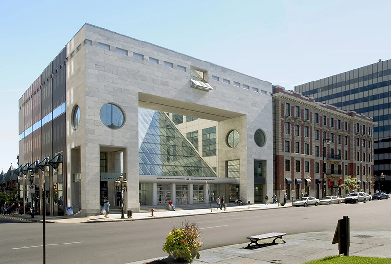
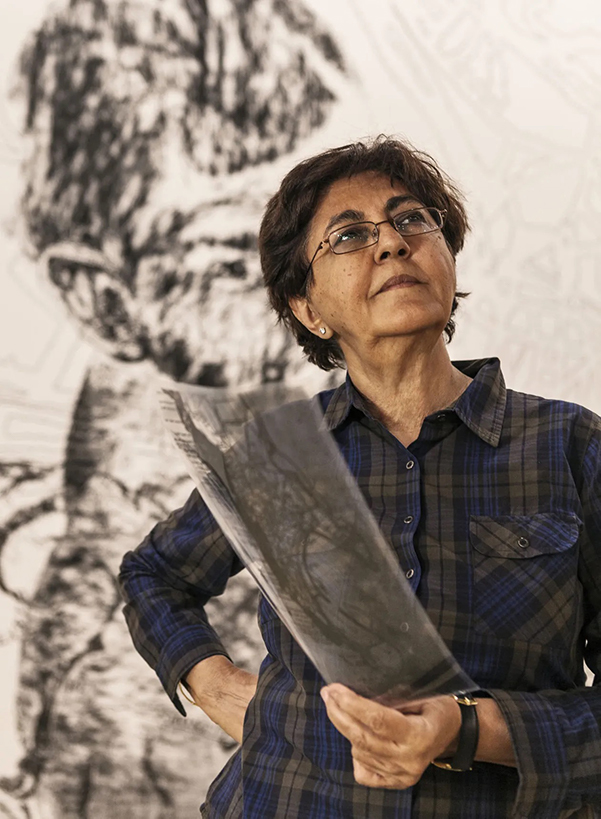
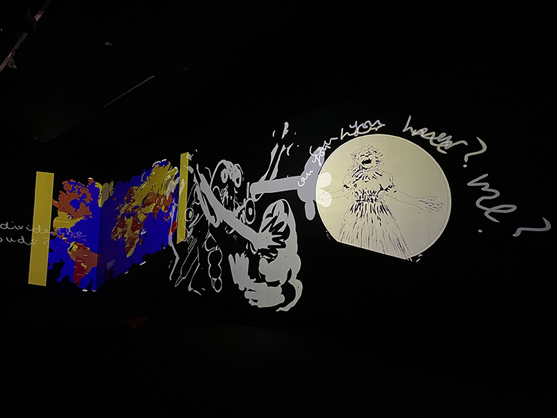
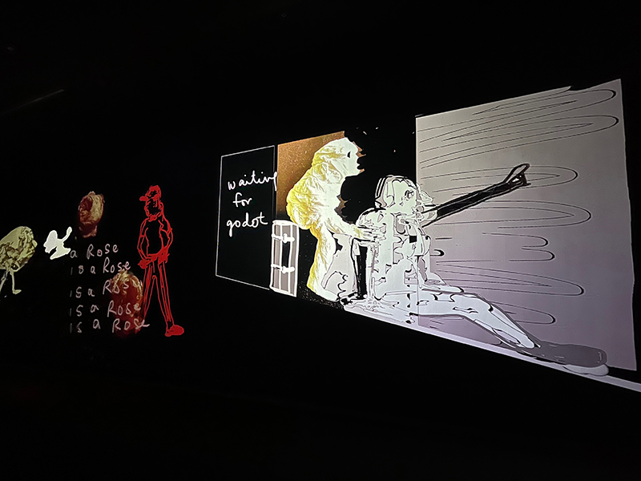
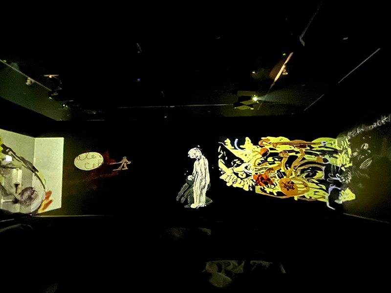
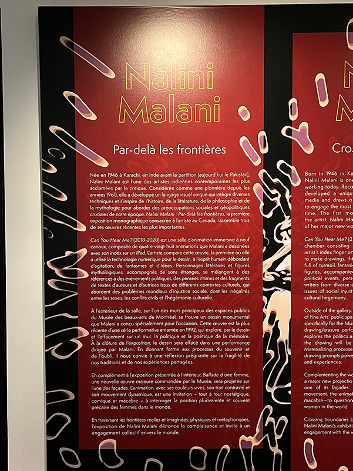
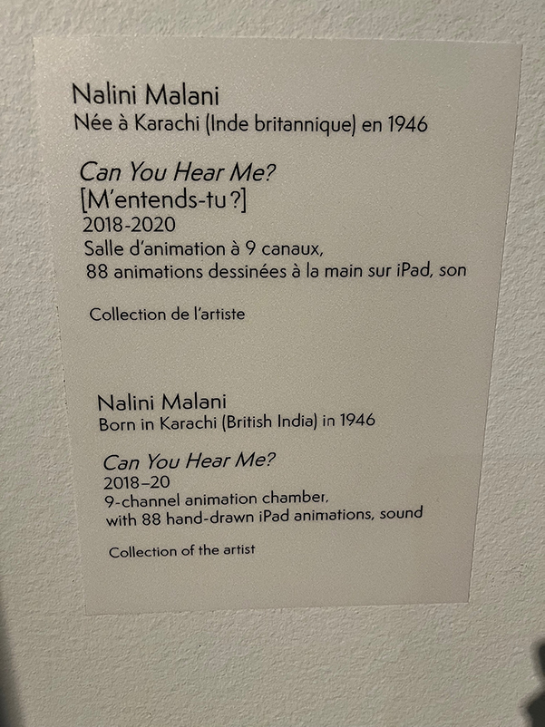
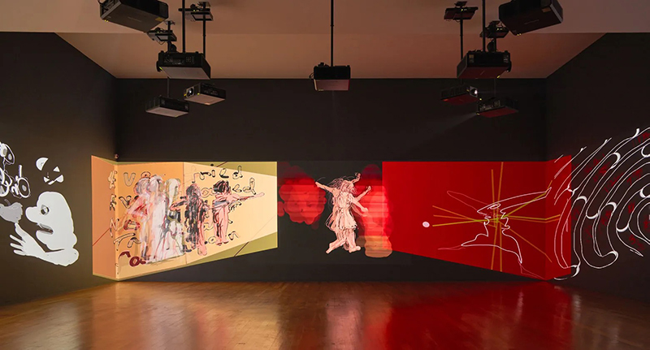
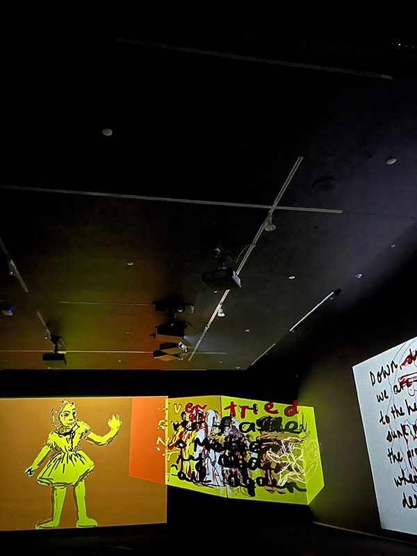
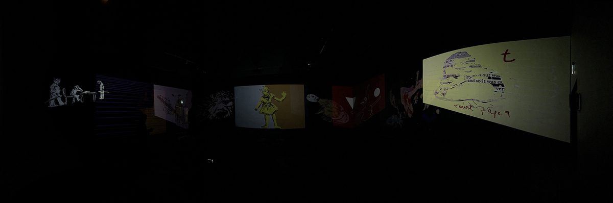

# Par-delà les frontières

Le 25 avril dernier, j'ai eu la chance de visiter l'exposition "Par-delà les frontières" au Musée des beaux-arts de Montréal. Cette exposition était une exploration d'œuvres d'art contemporain qui abordaient des thèmes universels tels que la guerre, la paix, la mémoire collective et les inégalités entre les sexes. Parmi les œuvres présentées, j'ai expérimenté l'installation "Can You Hear Me?".

## Can You Hear Me? [M’entends-tu?] (2018-2020)
L'œuvre « Can You Hear Me? » a été réalisée par l'artiste indienne Nalini Malani en 2018-2020. Nalini Malani (née en 1946) est considérée comme la pionnière de l'art vidéo en Inde et a travaillé dans le domaine de l'art multimédia depuis les années 1960. Elle intègre une variété de formes artistiques dans sa pratique, notamment l'animation, les arts scéniques, la photographie, la peinture, la performance, le cinéma et la vidéo. En 2019, elle a remporté le prix Joan-Miró et a présenté son travail dans 30 expositions individuelles dans des musées internationaux tels que le Centre Pompidou (Paris), la Whitechapel Gallery (Londres), le M+ (Hong Kong), l'Art Gallery of South Australia (Adélaïde) et la National Gallery (Londres). 

Elle a été exposée lors de l'événement. Cette installation se compose d'une salle d'animation à 9 canaux contenant 88 animations image par image dessinées à la main sur iPad. Elle plonge le public dans ce que Malani décrit comme un « cerveau plein d'agitation et d'idées ».

## Composantes et techniques

Étant donné que ce sont des projections d'animations de dessins il n'y a pas beaucoup d'équipement à première vue d'oeil. Il est possible de voir les 9 projecteurs  placé selon un angle intéressante pour donné une impression de perspective.

Les canaux sont suspendue au plafond par des barres de métals selon un angle intéressente pour donné une impression de perspective aux animations. Nous pouvons suposés les éléments nécessaires à la mise en exposition comme beaucoup de fil électrique et de branchement en arrière-scène pour pouvoir faire fonctioner l'installation

## Expérience vécue

Mon expérience de cette œuvre a été intense et captivante. Les images animées m'ont transporté dans l'univers de l'artiste qui m'a fait réfléchir sur les thèmes universels tels que la guerre, la paix, la mémoire collective et les inégalités entre les sexes. 

La qualité de l'animation était remarquable et la musique contribuait à renforcer l'impact émotionnel de l'installation. Il s'agit d'une œuvre immersive, sans aucune interactivité possible. Au centre de la pièce, il y avait des lazyboys pour permettre aux visiteurs de s'immerger davantage dans l'histoire. La musique, sans paroles, était étrange et renforçait l'atmosphère de l'installation. La mise en espace consistait en la projection des images sur trois des quatre murs de la pièce.

## Appréciation critique

j'ai aimer le style artistique de nina avec des dessins colorés et avec une forte signification.  Mon appréciation critique de cette œuvre est varié. J'ai été particulièrement impressionné par la qualité de l'animation et la pertinence des thèmes abordés. Les images symboliques et poétiques ont suscité en moi une réflexion sur notre société et ses défis actuels. Si je devais faire une critique constructive, je suggérerais peut-être d'ajouter une certaine interactivité pour permettre aux visiteurs d'explorer l'œuvre de manière plus personnelle. De plus, ralentir la vitesse de l'animation pourrait aider les spectateurs à mieux apprécier les différents dessins.

## Références

- Jean-Noël Desmarais Pavilion. Photo MMFA, Christine Guest (photo batisse) https://www.mbam.qc.ca/en/the-museum/jean-noel-desmarais-pavilion/
- Vue de l’installation Can You Hear Me? [M’entends-tu ?] de Nalini Malani au Museu de Arte Contemporânea de Serralves, Porto, 2020. Salle d’animation. © Nalini Malani / Photo Filipe Braga https://www.mbam.qc.ca/fr/expositions/nalini-malani/

